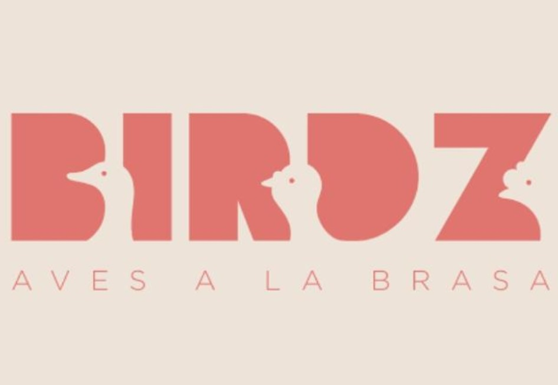

# 
ENTERPRISE PROJECT

    <strong>Birdz ENTERPRISE</strong> 
    </img> 
    <strong>Ingeniería de Software</strong> 
    <strong>StakeHolder: Jesus Sanchez Pinto</strong> 
     INFORME 

#### Startup: **BIRDZ**

#### Product: **BIRDZ**

# Team  Members:

|               Developer Team                |    Code    |
| :---------------------------------: | :--------: |
| Mauricio Abraham Rivo Rojas Sánchez | U202211572 |
|      Victor Manuel Meneses Arevalo  | U202211552 |

# Document Version Log 

<table>
    <thead>
        <tr>
            <th>Version</th>
            <th>Date</th>
            <th>Participants</th>
            <th>Observations</th>
        </tr>
    </thead>
    <tbody>
        <tr>
            <td>SPRINT 1</td>
            <td>24/07/2024</td>
            <td>Mauricio Abraham Rivo Rojas Sánchez</td>
            <td>
                <ul>
                    <li>Solution Profile</li>
                    <li>5W and 2H</li>
                    <li>Lean UX Canvas</li>
                </ul>
            </td>
        </tr>
        <tr>
            <td>SPRINT 1</td>
            <td>24/07/2024</td>
            <td>Victor Manuel Meneses Arevalo</td>
            <td>
                <ul>
                    <li>Chapter 1: Introduction</li>
                    <li>StartUp Description</li>
                </ul>
            </td>
        </tr>
    </tbody>
</table>

# Project Report Collaboration Insights

In this section, we log all the changes and commits done in the Github Organization. Additionally, compare our advances to the Sprint Goal.

## SPRINT 1

## SPRINT 2

## SPRINT 3

## SPRINT 4 

# Contenido

[Registro de Versiones del Informe](#registro-de-versiones-del-informe)

[Capítulo I: Introducción](#capítulo-i-introducción)

[1.1 Startup Profile](#11-startup-profile)  
[1.1.1. Descripción de la Startup](#111-descripción-de-la-startup)  

[1.2. Solution Profile](#12-solution-profile)  
[1.2.1 Antecedentes y problemática](#121-antecedentes-y-problemática)  
[1.2.2 Lean UX Process.](#122-lean-ux-process)  
[1.2.2.1. Lean UX Problem Statements.](#1221-lean-ux-problem-statements)  
[1.2.2.2. Lean UX Assumptions.](#1222-lean-ux-assumptions)  
[1.2.2.3. Lean UX Hypothesis Statements.](#1223-lean-ux-hypothesis-statements)  
[1.2.2.4. Lean UX Canvas.](#1224-lean-ux-canvas)

[1.3. Segmentos objetivo.](#13-segmentos-objetivo)

[Capítulo II: Requirements Elicitation & Analysis](#capítulo-ii-requirements-elicitation--analysis)

[2.1. Competidores](#21-competidores)  
[2.1.1. Análisis competitivo]()  
[2.1.2. Estrategias y tácticas frente a competidores](#211-análisis-competitivo)

[2.2. Entrevistas](#22-entrevistas)  
[2.2.1. Diseño de entrevistas](#221-diseño-de-entrevistas)    
[2.2.3. Análisis de entrevistas](#223-análisis-de-entrevistas)

[2.3. Needfinding](#23-needfinding)  
[2.3.1. User Personas](#231-user-personas)  
[2.3.2. User Task Matrix](#232-user-task-matrix)  
[2.3.3. User Journey Mapping](#233-user-journey-mapping)  
[2.3.4. Empathy Mapping](#234-empathy-mapping)  
[2.3.5. As-is Scenario Mapping](#235-as-is-scenario-mapping)

[2.4. Ubiquitous Language](#24-ubiquitous-language)

[Capítulo III: Requirements Specification](#capítulo-iii-requirements-specification)

[3.1. To-Be Scenario Mapping](#31-to-be-scenario-mapping)

[3.2. User Stories](#32-user-stories)

[3.3. Impact Mapping](#33-impact-mapping)

[3.4. Product Backlog](#34-product-backlog)

[Capítulo IV: Product Design](#capítulo-iv-product-design)

[4.1. Style Guidelines](#41-style-guidelines)  
[4.1.1. General Style Guidelines](#411-general-style-guidelines)  
[4.1.2. Web Style Guidelines](#412-web-style-guidelines)

[4.2. Information Architecture](#42-information-architecture)  
[4.2.1. Organization Systems](#421-organization-systems)  
[4.2.2. Labeling Systems](#422-labeling-systems)  
[4.2.3. SEO Tags and Meta Tag](#423-seo-tags-and-meta-tags)  
[4.2.4. Searching Systems](#424-searching-systems)   
[4.2.5. Navigation Systems](#425-navigation-systems)

[4.3. Landing Page UI Design](#43-landing-page-ui-design)   
[4.3.1. Landing Page Wireframe](#431-landing-page-wireframe)  
[4.3.2. Landing Page Mock-up](#432-landing-page-mock-up)

[4.4. Web Applications UX/UI Design](#44-web-applications-uxui-design)  
[4.4.1. Web Applications Wireframes](#441-web-applications-wireframes)  
[4.4.2. Web Applications Wireflow Diagrams](#442-web-applications-wireflow-diagrams)  
[4.4.2. Web Applications Mock-ups](#442-web-applications-mock-ups)   
[4.4.3. Web Applications User Flow Diagrams](#443-web-applications-user-flow-diagrams)

[4.5. Web Applications Prototyping](#45-web-applications-prototyping)

[4.6. Domain-Driven Software Architecture](#46-domain-driven-software-architecture)  
[4.6.1. Software Architecture Context Diagram](#461-software-architecture-context-diagram)  
[4.6.2. Software Architecture Container Diagrams](#462-software-architecture-container-diagrams)  
[4.6.3. Software Architecture Components Diagrams](#463-software-architecture-components-diagrams)

[4.7. Software Object-Oriented Design](#47-software-object-oriented-design)  
[4.7.1. Class Diagrams](#471-class-diagrams)  
[4.7.2. Class Dictionary](#472-class-dictionary)

[4.8. Database Design](#48-database-design)  
[4.8.1. Database Diagram](#481-database-diagram)

[Capítulo V: Product Implementation, Validation & Deploymen](#capítulo-v-product-implementation-validation--deployment)

[5.1. Software Configuration Management](#51-software-configuration-management)  
[5.1.1. Software Development Environment Configuration](#511-software-development-environment-configuration)  
[5.1.2. Source Code Management](#512-source-code-management)  
[5.1.3. Source Code Style Guide & Conventions](#513-source-code-style-guide--conventions)  
[5.1.4. Software Deployment Configuration](#514-software-deployment-configuration)

[5.2. Landing Page, Services & Applications Implementation](#52-landing-page-services--applications-implementation)  
[5.2.1. Sprint 1](#521-sprint-1)  
[5.2.1.1. Sprint Planning n](#5211-sprint-planning-1)  
[5.2.1.2. Sprint Backlog n](#5212-sprint-backlog-1)  
[5.2.1.3. Development Evidence for Sprint Review](#5213-development-evidence-for-sprint-review)  
[5.2.1.4. Testing Suite Evidence for Sprint Review](#5214-testing-suite-evidence-for-sprint-review)  
[5.2.1.5. Execution Evidence for Sprint Review](#5215-execution-evidence-for-sprint-review)  
[5.2.1.6. Services Documentation Evidence for Sprint Review](#5216-services-documentation-evidence-for-sprint-review)  
[5.2.1.7. Software Deployment Evidence for Sprint Review](#5217-software-deployment-evidence-for-sprint-review)  
[5.2.1.8. Team Collaboration Insights during Sprint](#5218-team-collaboration-insights-during-sprint)

[5.2.2. Sprint 2](#522-sprint-2)
 
[5.2.2.1. Sprint Planning 2](#5221-sprint-planning-2)

[5.2.2.2. Sprint Backlog 2](#5222-sprint-backlog-2)

[5.2.2.3. Development Evidence for Sprint Review](#5223-development-evidence-for-sprint-review)

[5.2.2.4. Testing Suite Evidence for Sprint Review](#5224-testing-suite-evidence-for-sprint-review)

[5.2.2.5. Execution Evidence for Sprint Review](#5225-execution-evidence-for-sprint-review)

[5.2.2.6. Services Documentation Evidence for Sprint Review](#5226-services-documentation-evidence-for-sprint-review)

[5.2.2.7. Software Deployment Evidence for Sprint Review](#5226-services-documentation-evidence-for-sprint-review)

[5.2.2.8. Team Collaboration Insights during Sprint](#5228-team-collaboration-insights-during-sprint)

[5.2.3. Sprint 3](#523-sprint-3)

 

[5.2.3.1. Sprint Planning 3](#5231-sprint-planning-3)

[5.2.3.2. Sprint Backlog 3](#5232-sprint-backlog-3)

[5.2.3.3. Development Evidence for Sprint Review](#5233-development-evidence-for-sprint-review)

[5.2.3.4. Testing Suite Evidence for Sprint Review](#5234-testing-suite-evidence-for-sprint-review)

[5.2.3.5. Execution Evidence for Sprint Review](#5235-execution-evidence-for-sprint-review)

[5.2.3.6. Services Documentation Evidence for Sprint Review](#5236-services-documentation-evidence-for-sprint-review)

[5.2.3.7. Software Deployment Evidence for Sprint Review](#5237-software-deployment-evidence-for-sprint-review)

[5.2.3.8. Team Collaboration Insights during Sprint](#5238-team-collaboration-insights-during-sprint)

 

[5.2.4.1. Sprint Planning 4](#5241-sprint-planning-4)

[5.2.4.2. Sprint Backlog 4](#5242-sprint-backlog-4)

[5.2.4.3. Development Evidence for Sprint Review](#5243-development-evidence-for-sprint-review)

[5.2.4.4. Testing Suite Evidence for Sprint Review](#5244-testing-suite-evidence-for-sprint-review)

[5.2.4.5. Execution Evidence for Sprint Review](#5245-execution-evidence-for-sprint-review)

[5.2.4.6. Services Documentation Evidence for Sprint Review](#5246-services-documentation-evidence-for-sprint-review)

[5.2.4.7. Software Deployment Evidence for Sprint Review](#5247-software-deployment-evidence-for-sprint-review)

[5.2.4.8. Team Collaboration Insights during Sprint](#5248-team-collaboration-insights-during-sprint)

[5.3. Validation Interviews](#53-validation-interviews)  
[5.3.1. Diseño de Entrevistas](#531-diseño-de-entrevistas)  
[5.3.2. Registro de Entrevistas](#532-registro-de-entrevistas)  
[5.3.3. Evaluaciones según heurísticas](#533-evaluaciones-según-heurísticas)

[5.4. Video About-the-Product](#54-video-about-the-product)

[Conclusiones](#conclusiones)

[Conclusiones y recomendaciones](#conclusiones-y-recomendaciones)

[Video About-the-Team](#video-about-the-team)

[Bibliografía](#bibliografía)

[Anexos](#anexos)

# Capítulo I: Introduction

## 1.1.1 Startup Description 

**Birdz Management System** is a comprehensive solution designed to manage all operations of Birdz restaurant, located in Miraflores. Similar to Pardos, this application allows managers and owners to have full control over all aspects of their business from anywhere and at any time, thanks to its intuitive and easy-to-use interface.

**Key Features:**

- **Income and Expense Management:** Offers detailed tracking of all restaurant income and expenses, providing real-time reports for informed decision-making.
- **Inventory Control:** With our application, Birdz can efficiently manage its inventories of food, beverages, and other supplies, avoiding shortages and waste.
- **Supplier Management:** We facilitate communication and relationship management with suppliers, allowing quick and efficient order placements.
- **Delivery Management:** Register delivery orders, assign orders to couriers, and track deliveries in real-time to ensure efficient and timely service.

### 1.1.1. StartUp Description

## 1.2. Solution Profile

The objective of Birdz Application is to offer a complete service to all the roles in the business. For example, the suppliers, clients, workers, and administrators. It's important to mention that it also attends to the storage necessity, like notifications when the supplies are almost empty.

### 1.2.1 Problem and Background

To compete with our competitors, we have to recognize our background and problem to solve.

**Background**

In the input industry, it is essential to have efficient organization, communication, and operations to satisfy the client. In recent years, we have noticed the significant evolution of the industry and customer expectations, influenced by technology and the fast expansion of the market or industry.

The great presence of online booking platforms and the constantly growing demand for personalized experiences have created a competitive environment for hotels of every status. Clients not only expect simple service; they expect high service with all the amenities, benefits, and without any setbacks.

Additionally, there is a lack of suitable tools.

**Problem Topic**

We are going to recognize our problem topic by the 5W and 2H method.

**What**

Birdz App is a robust and complete software that improves organization, communication, operations, and real-time decisions for the company workers, attending to the necessities of the workers, clients, admins, and suppliers. Some of the features that Birdz App has are:
- Software Segment for Suppliers
- Software Segment for Workers
- Software Segment for Clients
- Software Segment for Admins

**Who**

Restaurants all over the world face problems related to organization and lack of client interest. This software is for restaurants that want to have a better tool to improve organization, operations, communication, and real-time decisions.

**When**

The problem topic arises when the restaurant's organization is poor or regular, and clients are dissatisfied with the bad service from the restaurant. In that case, it is necessary to have good software to optimize speed and organization.

**Where**

The necessity of all these features is present in all restaurants. The significant advantage of speed, organization, and operations over other restaurants is indisputable.

**Why**

Inefficient management/organization can worsen the economy, communication, environment, etc. Consequently, it leads to an unsatisfactory experience for the client. 

**How**

Birdz App addresses this problem by providing a complete platform that pledges an intuitive UI and a comprehensive list of operations, segments, etc. In this way, the business will be easier to manage.

**How much**

At the beginning of the subscription model, each company that wants the software must pay the service's cost.

### 1.2.2 Lean UX Process
The Lean UX process addresses the business model vision that supports our project, with our main product being the software. Throughout this document and in this chapter, we explore several key elements of this process.

We start with the "Problem Statements," which cover aspects such as the domain, customer segments, pain points, gaps, vision/strategy, and the initial segment. Following the Lean UX methodology, we also consider the "Assumptions Statements" and the "Hypothesis Statements."

### 1.2.2.1 Lean UX Problem Statements
**Problem Statement:**
Efficient restaurant management presents significant challenges, including the lack of integrated tools that address all business facets. Owners and managers face difficulties in effectively managing income, inventory, suppliers, and human resources, which can result in revenue loss, resource waste, and unsatisfactory customer experiences.

**Domain:**
We focus on the restaurant industry. We recognize the diversity and complexity of this sector, which ranges from small family-owned restaurants to large chains, each with its unique needs and operational management challenges.

**Customer Segments:**
We target the owners and managers of Birdz, as well as its staff, administrators, and suppliers. We understand that restaurant management encompasses a wide range of establishments, and our platform is designed to adapt to the needs of all these segments.

**Pain Points:**

- **Difficulty in accurately tracking restaurant income and expenses:** The lack of adequate tools hinders effective monitoring of financial flows, which can lead to incorrect decisions and lost revenue.
- **Challenges in inventory management and supplier relationships:** Coordinating inventory and communication with suppliers can be complicated and time-consuming, resulting in supply shortages or overstock.
- **Complexities in managing staff and human resources:** Scheduling shifts, tracking attendance, performance evaluations, and payroll management are just some of the laborious tasks restaurant managers face in managing their staff.

**Vision/Strategy:**

Our vision is to provide an all-in-one, easy-to-use solution that addresses all the management needs of a restaurant, from finances to human resources. We strive to improve operational efficiency and customer experience by offering a centralized platform that simplifies and optimizes all operations related to restaurant management.

**Initial Segment:**

We initially focus on independent restaurants and small restaurant chains that seek accessible and efficient solutions to optimize their operations. We recognize the importance of providing affordable and adaptable tools for these segments, which often lack the resources of large chains but have an urgent need to improve their efficiency and competitiveness in the market.

#### 1.2.2.2. Lean UX Assumptions.

In this section, we cover the assumptions we can expect from our solution, from the features it should have to the outcomes from both our perspective and the users.

**Features:**

Here we list the tools we plan to implement in our solution.

- **Real-Time Tracking of Income and Expenses:** A tool to record and analyze the restaurant's financial flows, providing an instant view of the economic situation.
- **Inventory Management and Supplier Relationships:** Features to maintain precise control of the restaurant's supplies and facilitate communication with suppliers to place orders efficiently.
- **Staff Management Modules:** Tools to manage schedules, payroll, and performance evaluations of staff, optimizing human resource management.
- **Intuitive and Informative Interface:** An easy-to-use interface adaptable to the specific needs of each restaurant, ensuring a smooth and personalized user experience.
- **Real-Time Delivery Tracking:** Monitoring delivery orders, assigning orders to couriers, and tracking deliveries in real-time to ensure efficient and timely service.
- **Customer Ordering and Reservation System:** Features that allow customers to place orders, reserve tables, and manage their dining experiences remotely.
- **AI-Powered Alerts:** Implementing AI to alert when supplies are low or when an ingredient is almost out, and managing general alerts for better inventory control.

**Business Outcomes:**

Here we focus on what we aim to achieve as a restaurant management solution and what we need to see to know that our solution was successful and had the desired impact.

- **Leader in Technological Solutions for Restaurant Management:** We aim to be recognized as one of the leading players in the market for restaurant management software solutions by constantly incorporating new technologies, having an efficient and productive system for clients with features that anticipate, adapt, and respond to their needs.
- **Increase in Operational Efficiency:** After implementing the Birdz Management System, we expect a 30% reduction in time spent on administrative tasks such as inventory management and creating purchase orders when supplies are low, resulting in a tangible improvement in the restaurant's operational efficiency.
- **Improvement in Customer Satisfaction:** With the Birdz Management System, we expect to see an increase in the average customer satisfaction rating thanks to the ability to track orders, reserve tables remotely, and more.
- **Increase in Customer Base:** By digitizing more processes and making them available online, we anticipate an increase in the number of customers who can place their orders and reservations through the web, leading to an increase in the total number of orders.
- **Improvement in Profitability:** We expect a 10-15% increase in net profits within six months due to the increase in customer base, reduction in time spent on administrative tasks, and other optimizations facilitated by the system.

**Users:**

These are the users our solution is aimed at.

- Owners and managers of Birdz
- Staff
- Administrators
- Suppliers

**User Outcomes & Benefits:**

These are the immediate benefits users will gain from our solution.

- **Convenient Access to the Platform:** Users can easily access all the necessary tools for restaurant management from a single platform.
- **Real-Time Data-Driven Decision Making:** The availability of up-to-date information allows users to make informed and strategic decisions at the right time.
- **Reduction in Stress and Workload:** By automating processes and simplifying tasks, the Birdz Management System helps reduce the workload and stress associated with manual management processes.
- **Facilitation of Specific Tasks:** Such as accounting, supply purchases, or staff management.
- **Greater Efficiency and Communication:** With integrated systems that optimize task processes and direct communication systems, operational coordination is optimized.
- **Transparency of Actions and Greater Trust:** Creating a seamless experience that satisfies customers, especially in transactions, reservations, and orders.

**Business Assumptions:**

These are the assumptions we can make about our business.

- We believe that restaurants have a growing need for technological solutions that improve operational efficiency and business profitability.
- This need can be successfully addressed by the Birdz Management System, which offers an all-in-one, easy-to-use platform for restaurant management.
- The primary value our customers seek is a solution that simplifies the daily management of the restaurant and enhances the customer experience.
- We anticipate acquiring most of our customers through marketing strategies aimed at restaurant owners and managers, as well as through partnerships within the restaurant industry.
- We will generate revenue primarily through a one-time payment for the system, with the customer responsible for the cost of servers.
- While we face competition from other restaurant management solutions, we are confident that we can stand out through service quality, ease of use, and the ability to adapt to the specific needs of each restaurant.
- The main risk we face is not meeting customer expectations in terms of functionality, performance, and technical support.
- We plan to mitigate this risk by maintaining a customer-centric focus, providing continuous support, and regularly updating our platform to meet the changing needs of the restaurant market.

#### 1.2.2.3. Lean UX Hypothesis Statements.

Using the information collected in the Business Outcomes, Users, Benefits, and Features, we can formulate our hypotheses, each focused on a Feature to develop.

- Hypothesis 1:
We believe we can be recognized as a leader in technological solutions for restaurant management when restaurant owners and managers get a smooth and personalized user experience through our intuitive and customizable interface.

- Hypothesis 2:
We believe we will achieve increased operational efficiency if restaurant managers and owners get accurate, real-time financial data by tracking income and expenses in real time.

- Hypothesis 3:
We believe profitability improvement will be achieved if restaurant managers get optimized inventory and supplier management through our solution's inventory management and supplier relationship function.

- Hypothesis 4:
We believe we will achieve higher customer satisfaction if restaurant managers get more efficient staff management, which could be achieved through our solution's staff management modules.

- Hypothesis 5:
We believe customer retention will be achieved if restaurant managers and owners get a better centralized and efficient management experience through native integration with other existing restaurant management systems.

- Hypothesis 6:
We believe operational cost reduction will be achieved if restaurant managers get efficient coordination and control of inventories through our solution's inventory management and supplier relationship function.

- Hypothesis 7:
We believe we will expand our market presence if restaurants of different sizes get a solution adaptable to their specific needs with the intuitive and customizable interface.

#### 1.2.2.4. Lean UX Canvas.

|   |   |   |
|---|---|---|
| **Lean UX Canvas** |   |   |
| **1. Business Problem:**   Efficient restaurant management presents significant challenges, including the lack of integrated tools that address all facets of the business. Owners and managers face difficulties in effectively managing revenue, inventory, suppliers, and human resources, which can result in revenue loss, resource waste, and unsatisfactory experiences for customers. | **5. Solutions**   - **Process Automation:** Develop tools that automate repetitive tasks in restaurant management, such as generating financial reports or scheduling maintenance.   - **Real-time Analytics:** Implement tools that provide owners and managers with key information about the restaurant's performance.   - **Optimize Inventory and Human Resource Management:** Through specific tools in the application, restaurant resources management will be optimized.   - **Facilitate Internal Communication and Collaboration:** Through a system of instant and real-time notifications. | **2. Business Outcomes:**   - **Technology Solutions Leader for Restaurant Management:** We aim to be recognized as a leading provider in the market of software solutions for restaurant management, constantly incorporating new technologies, having an efficient and productive system for the customer, with functionalities that anticipate, adapt, and respond to their needs.   - **Increase in Operational Efficiency:** After the implementation of Birdz App, we expect a 30% reduction in the time spent on administrative tasks such as inventory and human resource management, resulting in a tangible improvement in the restaurant's operational efficiency.   - **Improvement in Profitability:** With the use of Birdz App, we anticipate a 15% increase in the restaurant's net profit margin within six months, thanks to more effective revenue and resource management that optimizes operating costs and maximizes revenue.   - **Higher Customer Satisfaction:** Thanks to Birdz App, we expect to see a 0.5 point increase in the average customer satisfaction rating in online reviews, reflecting improved customer experience through more efficient management and personalized service.   - **Customer Retention:** By using Birdz App, we foresee a 20% increase in the number of customers making repeat reservations within a year, indicating greater loyalty thanks to more effective management and a quality experience for customers.   - **Cost Reduction:** We will know our solution is effective when we see a 25% decrease in the restaurant's total operating costs, thanks to waste reduction and process optimization facilitated by automation and information centralization. |
| **3. Users:**   - **Restaurant Owners and Managers:** Seek technological solutions to optimize the management of their establishments and improve profitability.   - **Staff:** Responsible for specific tasks within the restaurant, such as accounting, purchasing, or human resources, looking for tools that simplify and streamline their daily responsibilities. |   | **4. User Outcomes & Benefits:**   - **Convenient Access to the Platform:** Users can easily access all necessary tools for restaurant management from a single platform.   - **Real-Time Data-Driven Decision Making:** Updated information availability allows users to make informed and strategic decisions at the right time.   - **Reduction of Stress and Workload:** By automating processes and simplifying tasks, Birdz App helps reduce the workload and stress associated with manual process management.   - **Facilitation of Specific Tasks:** Such as accounting, purchasing, and human resource management through specialized tools.   - **Greater Efficiency and Communication:** By having integrated systems that streamline task processes, and having a direct communication system, operational coordination is optimized.   - **Transparency of Actions and Greater Trust:** Creating a seamless experience that satisfies customers, especially in transactions and reservations. |
| **6. Hypotheses**   - We believe we can be recognized as a leader in technological solutions for restaurant management when restaurant owners and managers get a smooth and personalized user experience through our intuitive and customizable interface.   - We believe we will achieve increased operational efficiency if restaurant managers and owners get accurate, real-time financial data by tracking income and expenses in real time.   - We believe profitability improvement will be achieved if restaurant managers get optimized inventory and supplier management through our solution's inventory management and supplier relationship function.   - We believe we will achieve higher customer satisfaction if restaurant managers get more efficient staff management, which could be achieved through our solution's staff management modules.   - We believe customer retention will be achieved if restaurant managers and owners get a better centralized and efficient management experience through native integration with other existing restaurant management systems.   - We believe operational cost reduction will be achieved if restaurant managers get efficient coordination and control of inventories through our solution's inventory management and supplier relationship function.   - We believe we will expand our market presence if restaurants of different sizes get a solution adaptable to their specific needs with the intuitive and customizable interface. | **7. What’s the Most Important Thing We Need to Learn First?**   Understanding the specific needs and challenges of restaurant management: This will allow us to design solutions that address real problems and add value to owners and managers.   Analyzing the competitive landscape: It is crucial to understand the strengths and weaknesses of our competitors, as well as identify opportunities to differentiate ourselves in the market.   Clearly defining objectives and success metrics: Before moving forward with development, we need to establish clear and measurable goals for the platform, allowing us to evaluate its effectiveness and make adjustments as necessary. |
| **8. What's the least amount of work we need to do to learn the next most important thing?**   - **Satisfaction Surveys:** Conduct brief surveys among users to understand their initial needs and expectations regarding restaurant management and existing technological solutions.   - **Competitive Analysis:** Conduct a quick research to identify the main competitors in the restaurant management space and understand the key features of their platforms.   - **Identification of Key Metrics:** Determine the key metrics that will allow us to measure the platform's success, such as adoption rate, user retention, and customer satisfaction.   - **Prototype on the Concept:** Create a simple prototype or mock-up of the platform to get early feedback from users and validate the viability of the idea. |   |

## 1.3. Target Segments

Based on our identified users, we have defined our target segments to which our solution is directed.

**Users:**

### Administrators of Birdz

- **Location:** Primarily located in urban and commercial areas where Birdz restaurants operate.
- **Characteristics:** Administrators are deeply involved in the overall management of the restaurant, requiring access to all aspects of the system to oversee operations comprehensively. They prioritize efficiency, profitability, and comprehensive control over all operational facets. They are also focused on continuous improvement to ensure the success and growth of the restaurant.
- **Demographics:** Typically adults between the ages of 35 and 60. Their educational background varies from formal business education to extensive experience in restaurant management. They may have significant experience in the industry or be relatively new to the role but with a strong desire to optimize the restaurant's performance.

### Workers of Birdz

- **Location:** Located at the various Birdz restaurant locations, often in urban settings.
- **Characteristics:** Workers are dedicated to delivering high-quality customer service and ensuring an exceptional dining experience. They need tools to efficiently handle their specific tasks, from managing orders to interacting with the point-of-sale system. Adaptability and effective communication with both customers and colleagues are essential in their roles.
- **Demographics:** Generally young adults to middle-aged individuals. Their educational background ranges from secondary education to specialized training in hospitality and food service. Their work experience varies, including both new employees and seasoned professionals in the restaurant industry.

### Customers of Birdz

- **Location:** Typically reside in urban and suburban areas where Birdz restaurants are situated. They may include both local patrons and visitors.
- **Characteristics:** Customers seek a seamless and enjoyable dining experience, including easy ordering, reservations, and quick service. They value convenience and efficiency and prefer platforms that enhance their overall dining experience, including online ordering and reservation systems.
- **Demographics:** Wide-ranging, including individuals of all ages and backgrounds who frequent restaurants for dining out, with varying levels of tech-savviness.

### Suppliers of Birdz

- **Location:** May be based locally or regionally, depending on the supply chain and delivery logistics for Birdz.
- **Characteristics:** Suppliers provide the necessary ingredients and materials for the restaurant. They need a reliable and efficient system for managing orders and inventory levels. Good communication and timely responses are crucial for maintaining a smooth supply chain and ensuring the restaurant’s needs are met without disruption.
- **Demographics:** Typically businesses rather than individuals, with varying sizes from small local suppliers to larger distributors. They generally have a strong focus on logistics and supply chain management.

# 2.1. Competidores

## Uber Eats (Indirecto)

Uber Eats es una plataforma popular de pedidos y entrega de comida en línea donde los clientes pueden ordenar comida de restaurantes locales a través de la aplicación o sitio web de Uber Eats. Ofrece varias promociones, seguimiento en tiempo real y una interfaz amigable para el usuario, haciéndolo una opción preferida para muchos clientes.

## PedidosYa (Indirecto)

PedidosYa es otro servicio líder de entrega de alimentos en América Latina, similar a Uber Eats. Permite a los usuarios navegar por restaurantes locales, ordenar comida y tenerla entregada en su hogar. También proporciona varias opciones de pago y seguimiento de pedidos en tiempo real.

## RestuSoft (Directo)

RestuSoft es un software de gestión de restaurantes diseñado para optimizar las operaciones diarias como reservas, gestión de pedidos, control de inventario y gestión de relaciones con los clientes (CRM). Es un competidor directo porque ofrece una solución integral similar a BIRDZ Management System.

## FoodTrack (Directo)

FoodTrack es una solución de software enfocada en el seguimiento en tiempo real de las entregas de comida, gestión de inventario y coordinación de proveedores. Proporciona herramientas para que los restaurantes gestionen eficientemente su cadena de suministro y aseguren la entrega oportuna de productos alimenticios.

## 2.1.1. Análisis Competitivo

| Criterio | BIRDZ Management System | Uber Eats (Indirecto) | PedidosYa (Indirecto) | RestuSoft (Directo) | FoodTrack (Directo) |
|----------|--------------------------|----------------------|-------------------------|------------------|--------------------|
| Overview | Sistema integral de gestión empresarial para operaciones de restaurantes, incluyendo proveedores, trabajadores, entregas y seguimiento en tiempo real. | Plataforma de pedidos y entrega de comida en línea con seguimiento en tiempo real y interfaz amigable para el usuario. | Plataforma de pedidos y entrega de comida en línea con varias opciones de pago y seguimiento de pedidos en tiempo real. | Software de gestión de restaurantes para optimizar operaciones diarias y CRM. | Solución de software para seguimiento en tiempo real de entregas de comida, gestión de inventario y coordinación de proveedores. |
| Ventaja Competitiva | Ofrece una solución completa, sencilla, ademas de ser altamente personalizable y escalable gracias a DDD, para administrar todos los aspectos de las operaciones de restaurantes con capacidades de seguimiento en tiempo real. | Llegada masiva y base de usuarios, ofreciendo conveniencia y varias promociones. | Fuerte presencia en América Latina con un enfoque en conveniencia y múltiples opciones de pago. | Enfoque en optimizar operaciones diarias de restaurantes con un conjunto completo de características. | Énfasis en seguimiento en tiempo real y gestión eficiente de la cadena de suministro. |
| Mercado Objetivo | Administradores, trabajadores, clientes y proveedores de restaurantes Birdz. | Restaurantes y clientes buscando servicios de entrega de comida. | Restaurantes y clientes buscando servicios de entrega de comida. | Restaurantes de mediano a gran tamaño buscando soluciones de gestión integrales. | Restaurantes necesitando herramientas eficientes para la gestión de la cadena de suministro y la entrega. |
| Estrategias de Marketing | Enfoque directo y personalizado con los propietarios de BIRDZ, asi como capacitaciones detalladas para asegurar un uso óptimo del sistema. | Publicidad en múltiples plataformas digitales y uso de asociaciones con influencers. | Campañas de marketing digital y asociaciones con negocios locales. | Ventas directas, demostraciones en línea y colaboraciones con asociaciones de restaurantes. | Marketing de contenidos enfocado en la eficiencia de la cadena de suministro y los beneficios del seguimiento en tiempo real. |
| Productos & Servicios | Módulos para proveedores, trabajadores, entregas y seguimiento en tiempo real. | Ordenamiento y entrega de comida, ofertas promocionales y aplicación amigable para el usuario. | Ordenamiento y entrega de comida con múltiples opciones de pago y seguimiento en tiempo real. | Características para reservas, gestión de pedidos, control de inventario y CRM. | Herramientas para seguimiento de entregas, gestión de inventario y coordinación de proveedores. |
| Precios & Costos | Pago vitalicio por la totalidad del sistema, junto con una mensualidad por el mantenimiento del mismo. | Tarifas de servicio en los pedidos realizados a través de la plataforma. | Tarifas de servicio en los pedidos realizados a través de la plataforma. | Precios de suscripción con varios niveles dependiendo del conjunto de características. | Modelo de suscripción adaptado para diferentes tamaños de restaurantes y necesidades. |
| Canales de Distribución (Web o móvil) | Aplicaciones web y móviles. | Aplicación móvil y sitio web. | Aplicación móvil y sitio web. | Plataforma basada en web con soporte de aplicación móvil. | Plataforma basada en web con soporte de aplicación móvil. |
| Fortalezas | Solución integral, modular, escalable con seguimiento en tiempo real, enfocada totalmente a las necesidades de la empresa BIRDZ. | Base de usuarios amplia, conveniencia y fuerte reconocimiento de marca. | Fuerte presencia en América Latina y múltiples opciones de pago. | Conjunto completo de características para gestionar operaciones de restaurantes. | Énfasis en seguimiento en tiempo real y eficiencia de la cadena de suministro. |
| Debilidades | Requiere configuración inicial y formación para su uso óptimo. | Menos enfoque en la gestión de operaciones de restaurantes. | Menos enfoque en la gestión de operaciones de restaurantes. | Mayor costo para restaurantes más pequeños. | Enfoque limitado en la gestión general de operaciones de restaurantes. |
| Oportunidades | Demanda creciente de soluciones eficientes de gestión de restaurantes del tipo de BIRDZ | Expansión del alcance del mercado e introducción de nuevas características. | Expansión del alcance del mercado e introducción de nuevas características. | Expansión a mercados internacionales y añadiendo nuevas características. | Expansión del alcance del mercado y añadiendo más funcionalidades. |
| Amenazas | Competencia de otras soluciones completas de gestión de restaurantes. | Cambios en las preferencias de los consumidores y competencia de mercado. | Cambios en las preferencias de los consumidores y competencia de mercado. | Competencia de otros softwares de gestión de restaurantes establecidos. | Competencia de otras soluciones de gestión de la cadena de suministro. |

# 2.1.2. Estrategias y Tácticas Frente a Competidores

Después de realizar los análisis correspondientes, las principales estrategias contra competidores son:

## A) Diferenciación de Servicios

**Estrategia:** Identificar y desarrollar características únicas que hagan que BIRDZ Management System se destaque de otras soluciones en el mercado.

**Tácticas:**
- Realizar constantes reuniones con el personal de BIRDZ para garantizar una solución que cubra totalmente sus necesidades.
- Desarrollar nuevas funciones o servicios innovadores que aborden estas necesidades de manera efectiva y persolanizada.
- Promover activamente estas características diferenciadoras a través de capacitaciones y presentaciones detalladas.

## B) Calidad Consistente

**Estrategia:** Garantizar altos estándares de calidad en todos los aspectos de la aplicación y su servicio.

**Tácticas:**
- Implementar rigurosos controles de calidad durante el desarrollo y la implementación de la aplicación.
- Ofrecer capacitación y soporte a los clientes para garantizar un uso óptimo de BIRDZ Management System.
- Recopilar y analizar regularmente retroalimentación de los clientes para identificar áreas de mejora en la calidad y tomar medidas correctivas en las etapas de prueba.

## C) Precios Competitivos

**Estrategia:** Ofrecer una propuesta de valor atractiva que justifique el precio de BIRDZ Management System en comparación con otras soluciones en el mercado.

**Tácticas:**
- Realizar análisis de precios comparativos para asegurarse de que los precios de BIRDZ Management System sean competitivos pero también rentables.
- Ofrecer opciones de precios flexibles y personalizadas para adaptarse a las necesidades y presupuestos de diferentes tipos de restaurantes.
- Destacar el retorno de la inversión (ROI) y los beneficios adicionales que ofrece BIRDZ Management System para justificar su precio.

## D) Atención al Cliente de Calidad

**Estrategia:** Priorizar la satisfacción del cliente y establecer relaciones sólidas con los usuarios de BIRDZ Management System.

**Tácticas:**
- Ofrecer un manual de uso detallado, para que en caso de algún error en la manipulación del sistema se lleguea dar, sea fácil de slucionar.
- Implementar un canal de comunicación directo para consultas con nuestro equipo por parte de los clientes.
- Fomentar una cultura interna centrada en el cliente y capacitar al equipo para entender y satisfacer las necesidades de los usuarios.

## E) Innovación Continua

**Estrategia:** Mantenerse a la vanguardia de la innovación en tecnología y gestión de restaurantes para ofrecer constantemente nuevas soluciones y mejoras.

**Tácticas:**
- Centrarse en las etapas tempranas de diseño en buscar los patrones y prácticas más modernas para ofrecer un producto de calidad y que se mantenga a la vanguardia por mucho tiempo.
- Realizar una exhaustiva comunicación con el stakeholder para asegurarse de estar creando una solución a la medida de sus necesidades.
- Colaborar con expertos de la industria para desarrollar soluciones avanzadas y adaptadas a las necesidades cambiantes de los restaurantes.

# 2.3. Needfinding

Para tener una mejor idea de cómo será la experiencia del usuario con nuestro producto, utilizaremos las siguientes herramientas:

## User Persona

Describiremos detalladamente los perfiles de nuestros usuarios objetivo, incluyendo sus objetivos, frustraciones, biografía y preferencias de comunicación.

## User Task Matrix

Identificaremos y categorizaremos las tareas clave que cada tipo de usuario necesita realizar con el sistema, destacando las tareas más críticas para cada perfil.

## User Journey Mapping

Visualizaremos el recorrido del usuario desde el primer contacto con el sistema hasta la finalización de sus objetivos, identificando puntos de dolor y oportunidades de mejora en cada etapa.

## Empathy Mapping

Profundizaremos en la comprensión de los pensamientos, sentimientos, acciones y necesidades de los usuarios, asegurándonos de que el sistema responda a sus expectativas y emociones.

## As-is Scenario Mapping

Documentaremos el escenario actual de los procesos de gestión en el restaurante Birdz, identificando áreas donde el sistema BIRDZ Management System puede ofrecer mejoras significativas y soluciones innovadoras.

# 2.3.1. User Personas

These User Persona profiles are based on the analysis of interviews and competitive research, allowing us to create detailed and realistic representations of our target users. By developing User Personas, we aim to understand the primary characteristics, needs, and behaviors of our end-users, including their objectives, personality traits, preferred technologies, and communication channels. These representations help us to humanize and visualize our users, which in turn guides the design of products and services that meet their demands and expectations within the context of our project.

**Admins Segment:**  

**Workers Segment:**  

**Suppliers Segment:**  

**Clients Segment:**  

## 2.3.2. User Task Matrix

This section presents User Task Matrix, it's a tool that allow identify important and frequently tasks that do the "User Personas" in their laboral 
environment. By this matrix, we can compare and constrast the more frequently tasks of provider, administrators and customers. By comparing facts 
like frequence and importance, we understand better the necessities and challenges of our "User Personas".

| Task                                           | Manager (Frequency / Importance) | Employee (Frequency / Importance) | Customers (Frequency / Importance) | Providers (Frequency / Importance) |
|------------------------------------------------|-----------------------------|---------------------------|--------------------------|----------------------------|
| Staff supervision                              | High / High                 | Medium / High             | N/A                      | N/A                        |
| Restaurant cleaning scheduling                 | Medium / Medium             | High / High               | N/A                      | N/A                        |
| Staff shift scheduling                         | High / High                 | Low / Medium              | N/A                      | N/A                        |
| Negotiation with suppliers                     | High / High                 | Low / Low                 | N/A                      | High / High                |
| Staff training                                 | High / High                 | Medium / High             | N/A                      | N/A                        |
| Staff performance evaluation                   | Medium / High               | Medium / High             | N/A                      | N/A                        |
| Compliance with regulatory principles          | High / High                 | High / High               | N/A                      | N/A                        |
| Equipment maintenance scheduling               | Medium / Medium             | High / High               | N/A                      | N/A                        |
| Inventory management                           | High / High                 | Medium / High             | N/A                      | High / High                |
| Resource management                            | High / High                 | Low / Low                 | N/A                      | N/A                        |
| Food quality verification                      | Medium / High               | High / Medium             | High / High              | High / High                |
| Staff permissions management                   | High / High                 | Low / High                | N/A                      | N/A                        |
| Work shift scheduling                          | High / High                 | Low / Medium              | N/A                      | N/A                        |
| Event or activity planning                     | Medium / High               | Low / Low                 | High / High              | N/A                        |
| Financial and accounting report preparation    | High / High                 | Medium / High             | N/A                      | N/A                        |
| Reservation control                            | Medium / Medium             | High / High               | High / High              | N/A                        |
| Customer order management                      | Medium / Medium             | High / High               | High / High              | N/A                        |
| Responding to customer inquiries and requests  | Low / Low                   | Medium / High             | High / High              | N/A                        |
| Establishing regulatory principles             | High / High                 | Low / Medium              | N/A                      | N/A                        |
| Public relations and marketing                 | High / High                 | Medium / High             | High / High              | N/A                        |
| Coordination of supplier deliveries            | High / High                 | Medium / High             | N/A                      | High / High                |
| Receiving deliveries                           | Medium / High               | High / High               | N/A                      | High / High                |
| Providing feedback on ingredients              | Medium / High               | Medium / High             | N/A                      | High / High                |
| Payment management for suppliers               | High / High                 | Low / Low                 | N/A                      | High / High                |
| Participation in loyalty programs              | Medium / Medium             | Medium / Medium           | High / High              | N/A                        |
| Reviews and recommendations                    | Medium / High               | High / High               | High / High              | N/A                        |

### Tasks with the Highest Frequency and Importance:

**Staff Supervision**: This task is crucial for both the manager and the employee, as it ensures that all assigned functions and roles are carried out in an organized, efficient, and correct manner.

**Food Quality Verification**: This task is of high importance to both the manager and the employee, as it ensures customer satisfaction and meets the expectations customers have of the restaurant. For the employee, it is a highly important task as it facilitates maintaining the quality standards of the restaurant.

**Staff Performance Evaluation**: Both the manager and the employee perform this task with high frequency and importance, as it ensures that the restaurant has workers and administrators who fulfill their roles and functions quickly and organized according to the restaurant’s standards.

**Compliance with Regulatory Principles**: This task is of high importance for the manager. Ensuring regulatory compliance means following established procedures and policies, as well as guaranteeing that all activities are carried out in accordance with the applicable regulations and standards in the restaurant industry.

**Work Shift Scheduling**: Coordinating the needs of the restaurant with the availability of the staff is crucial for efficient and effective restaurant operations. Both the workers and the manager play important roles in this process, each with different levels of responsibility and authority.

**Staff Training**: Training the staff is fundamental for both the workers and the restaurant managers to ensure that the staff is well-prepared and has the necessary skills to provide quality service to customers and contribute to the overall success of the restaurant.

**Customer Order Management**: This task is crucial for both segments, as it allows for controlling customer orders and ensuring they are satisfied with their dining experience, facilitating efficient service and operations.

### Main Differences and Similarities Between the Roles:

**Differences**:

- **Negotiation with Suppliers**: This is a task of high importance for the manager but of low importance for the staff. This reflects the level of responsibility and the strategic nature of the decisions the manager makes compared to the more operational tasks of the employee.
  
- **Responding to Customer Inquiries and Requests**: This task is of high importance for the staff, as they interact more with the customers and are more available to address their inquiries and requests. Conversely, it is of low importance for the manager as their role is more related to the logical and administrative aspects of the business.

**Similarities**:

- **Staff Performance Evaluation**: Both the manager and the employee participate in evaluating staff performance, highlighting the shared importance of ensuring a well-trained and motivated team to provide quality service.
  
- **Financial and Accounting Report Preparation**: This task is of high importance for both roles, emphasizing the need to make data-driven decisions to improve operational efficiency and customer experience.

## 2.3.3. User Journey Mapping

This section will detail all the important interactions with BIRDZ, contact facts and emotive experience by the application. The objective is identify opportunities of improvement and optimize 
the user experience. The following description process:

Sure, here's the completed User Journey Map for each target segment:

### User Journey Map - Administrator

**Beginning of the Day**:

- Staff Supervision: Ensure all employees are present and ready for their shifts.
- Review Daily Schedule: Check the schedule for the day, including reservations and events.
- Compliance Check: Verify that the restaurant is compliant with regulatory standards.

**Middle of the Day**:

- Staff Training: Conduct or oversee any ongoing training sessions.
- Negotiation with Suppliers: Communicate with suppliers to manage inventory and order ingredients.
- Performance Evaluation: Monitor and evaluate staff performance throughout the day.
- Financial Reporting: Review and update financial and accounting reports.

**End of the Day**:

- Staff Performance Review: Provide feedback to staff on their performance.
- Compliance Check: Ensure all regulatory compliance tasks are completed.
- Closing Procedures: Oversee the closing of the restaurant, ensuring everything is secure and ready for the next day.

### User Journey Map - Employee

**Beginning of the Day**:

- Preparation: Set up the restaurant for opening, including cleaning and organizing the space.
- Staff Briefing: Attend the morning briefing to understand the tasks and goals for the day.
- Customer Interaction: Prepare to welcome the first customers and take their orders.

**Middle of the Day**:

- Order Management: Manage customer orders, ensuring timely and accurate service.
- Food Quality Verification: Ensure all food served meets quality standards.
- Respond to Inquiries: Address customer questions and requests promptly.

**End of the Day**:

- Cleaning: Clean the restaurant after service, including dining areas and kitchen.
- Inventory Check: Assist in checking inventory levels and report any shortages.
- Closing Procedures: Help with closing the restaurant, including securing all areas and preparing for the next day.

### User Journey Map - Provider

**Beginning of the Day**:

- Delivery Scheduling: Plan and schedule deliveries for the day.
- Quality Check: Ensure all products are of high quality and ready for delivery.

**Middle of the Day**:

- Delivery Coordination: Deliver ingredients and supplies to the restaurant.
- Feedback Collection: Collect feedback from the restaurant on the quality and timeliness of deliveries.

**End of the Day**:

- Payment Management: Ensure all invoices are submitted and payments are managed.
- Schedule Planning: Plan for the next day’s deliveries and coordinate with the restaurant for any special requirements.

### User Journey Map - Customer

**Beginning of the Day**:

- Reservation/Order: Make a reservation or place an order for the day.

**Middle of the Day**:

- Arrival: Arrive at the restaurant and check-in for the reservation.
- Dining Experience: Enjoy the meal, interact with staff, and provide feedback if necessary.

**End of the Day**:

- Feedback: Provide feedback on the dining experience through reviews or surveys.
- Participation in Loyalty Programs: Engage in any loyalty programs or promotions offered by the restaurant.

These User Journey Maps outline the key tasks and interactions each segment has throughout a typical day, ensuring smooth operations and a positive experience for everyone involved in the restaurant business.

## 2.3.4. Empathy Mapping 

During this process, we've collected really important behavior patterns, commons topics, and 
data analysis. After that, we created one profile that represents each target segment. Finally, we 
used the collected information to design a "Empathy Map" that organize emotions, thoughts and 
actions of the users.

**Administrator Target Segment**

**Customer Target Segment**

**Provider Target Segment**

**Employee Target Segment**

## 2.3.5. As-Is Scenario Mapping

# 2.4. Ubiquitous Language

**General Terms**
Restaurant: BIRDZ, the establishment offering food and services.
Menu: The list of available dishes and beverages offered by BIRDZ.
Order: A request by a Customer for specific dishes and beverages.
Reservation: A booking made by a Customer for a table at BIRDZ.
Inventory: The stock of ingredients and supplies needed for the restaurant.
 
**Customers**
Customer: An individual who visits BIRDZ to dine.
Loyalty Program: A system to reward regular Customers with discounts and special offers.
Feedback: Comments and ratings provided by Customers about their dining experience.
Customer Profile: Information about a Customer, including contact details and dining preferences.
 
**Suppliers**
Supplier: A business or individual providing ingredients and supplies to BIRDZ.
Purchase Order: A formal request sent to a Supplier for specific ingredients and supplies.
Delivery Schedule: The agreed-upon times and dates for Suppliers to deliver goods to BIRDZ.
Invoice: A bill sent by a Supplier to BIRDZ for delivered goods.
 
**Administrators**
Administrator: A person responsible for managing operations at BIRDZ.
Sales Report: A document detailing the revenue and sales performance over a period.
Expense Report: A document outlining the costs and expenses incurred by BIRDZ.
Payroll: The system for managing and distributing wages to Workers.
Compliance: Ensuring that BIRDZ adheres to health, safety, and legal regulations.
 
**Workers**
Worker: An individual employed at BIRDZ, including chefs, waitstaff, and cleaners.
Shift Schedule: The planned working hours and assignments for Workers.
Training Program: Educational sessions to improve Workers' skills and knowledge.
Performance Review: Regular evaluations of a Worker’s job performance.
Task Assignment: Specific duties and responsibilities allocated to Workers.
 
**Operations**
Kitchen: The area where food is prepared.
Dining Area: The space where Customers eat their meals.
Point of Sale (POS) System: The system used to handle transactions and manage sales data.
Reservation System: The platform used to manage table bookings and reservations.
Inventory Management System: A tool for tracking and ordering supplies.

# Capítulo III: Requirements Specification

En este capítulo, nos centraremos en definir los requerimientos que debemos cumplir para el exito de nuestra solución.

## 3.1. To-Be Scenario Mapping.

En este apartado se presentan los To-Be Scenario Mapping para los segmentos de gerentes y trabajadores, que describen cómo serán las interacciones y tareas de los usuarios con el sistema de gestión hotelera una vez implementado. Estos mapas proporcionan una visión general de las funcionalidades y características que se espera que tenga el producto final, y sirven como guía para el diseño y desarrollo del sistema.

Segmento 1:

El To-Be Scenario Mapping para el segmento Gerentes.

Segmento 2:

El To-Be Scenario Mapping para el segmento Trabajadores.

## 3.2. User Stories.

Redactamos las historias de usuario para el sistema de gestión hotelera basándonos en las necesidades y desafíos identificados en las entrevistas y el análisis de los segmentos de gerentes y trabajadores. Las historias de usuario describen las funcionalidades y características que los usuarios finales esperan del sistema, y se utilizan para guiar el diseño y desarrollo del producto.

| HUX/EPX | Historia de Usuario / Épica                                   | Descripción                                                                                                                                            | Criterios de Aceptación                                                                                                                                                                                                                                                                                                                          | Relacionado con (Epic ID) |
|---------|---------------------------------------------------------------|--------------------------------------------------------------------------------------------------------------------------------------------------------|--------------------------------------------------------------------------------------------------------------------------------------------------------------------------------------------------------------------------------------------------------------------------------------------------------------------------------------------------|---------------------------|
| EP01    | Información del producto                                      | Como visitante del sitio web, quiero obtener información relacionada al producto que se ofrece.                                                        | Dado que el visitante está en la página de inicio   Cuando observa la información del producto que se está ofreciendo   Entonces obtiene una mejor visión de lo que ofrece la empresa.   Y se registra o considera registrarse como usuario.                                                                                                            |                           | 
| HU01    | Obtener información de la empresa                           | Como visitante del sitio web, quiero obtener más información sobre la empresa a cargo del producto.                                                    | Dado que el visitante se encuentra en la sección de nosotros   Cuando observa la información relevante sobre la empresa   Entonces se interesa en saber más del producto   Y se registra como usuario.                                                                                                                    | EP01                      | 
| HU02    | Informarse sobre los beneficios del producto                  | Como visitante del sitio web, quiero informarme sobre los beneficios del producto ofrecido.                                                            | Dado que el visitante se encuentra en la sección de beneficios   Cuando observa los beneficios que se ofrecen al usar nuestra solución   Entonces se interesa en saber más del producto   Y se registra como usuario.                                                 | EP01                      |
| HU03    | Conocer los testimonios de los clientes pasados               | Como visitante, quiero acceder a testimonios de clientes anteriores para evaluar la experiencia y el desempeño del personal.      | Dado que el visitante se encuentra en la sección de testimonios   Cuando observa los diferentes testimonios   Entonces evalúa la experiencia y desempeño del personal basado en los comentarios de clientes previos.   Y considera registrarse como usuario.                                                                               | EP01                      |
| HU04    | Informarse sobre los diferentes planes de precio del producto | Como visitante, quiero conocer los diferentes planes de precio disponibles para el producto ofrecido. | Dado que el visitante se encuentra en la sección de planes de precios disponibles   Cuando visualiza los diferentes planes   Entonces puede entender las opciones disponibles y tomar decisiones informadas sobre el producto.   Y registrarse como usuario.                                                                                                    | EP01                      |
| HU05    | Contactar con la empresa                                      | Como visitante, quiero poder contactarme fácilmente con la empresa desde la página de inicio.                 | Dado que el visitante accede a la sección de contacto   Cuando observa los diferentes medios para contactarse con nosotros   Entonces se comunicará con nosotros rápidamente.                                                                                       | EP01                      |
| EP02    | Crear cuenta                                                  | Como gerente del hotel/hostal quiero crear una cuenta para utilizar InnControl (aplicación).                                                           | Dado que el usuario se encuentra en el Login   Cuando presiona en el botón "SignUp".   E ingresa sus datos.   Entonces se le presentará con el plan que se acomoda mejor a las necesidades del negocio   Y realiza el pago.<Y> Crea su cuenta de gerente.                                                                       | -                         |
| HU01    | Crear cuenta empleado                                         | Como empleado, quiero crear mi cuenta de empleado.                                                                  | Dado que el usuario se encuentra en el login   Cuando selecciona que quiere crear una cuenta con el botón signup   E ingresa el correo del hotel   E ingresa sus datos   Entonces se muestra un mensaje de bienvenida   Y se muestra el dashboard de empleado.                                                                    | EP02                      |
| HU02    | Crear cuenta gerente                                          | Como gerente, quiero crear mi cuenta de gerente para poder gestionar a mis empleados.                                                | Dado que se paga el plan   Cuando el usuario ingrese sus datos de hotel y gerente   Entonces se muestra un mensaje de bienvenida   Y se muestra el dashboard de gerente.                                                                                                   | EP02                      |
| EP03    | Gestionar Habitaciones del Hotel                              | Como gerente, quiero poder revisar el estado de las habitaciones.                                                                                      | Dado que el usuario está en la ruta de habitaciones   Cuando revisa las habitaciones creadas   Entonces puede ver los estados, reservaciones, el tipo de habitación, el número de habitación y el cliente   Y se muestra también un botón para crear habitaciones. | -                         |
| HU01    | Cambiar estado de habitación                                  | Como gerente, quiero realizar un cambio al estado de la habitación.                                                                                    | Dado que el usuario ingresa a la ruta de Habitaciones  Cuando el usuario usa el botón para editar   Y selecciona uno de los estados en el popup   Entonces el estado de la habitación se actualiza.                                                                                                                                          | EP03                      |
| HU02    | Cambiar estado de habitación (Empleado)                                  | Como empleado, quiero cambiar el estado de la habitación de mi tarea para notificar que ya terminé mi tarea.                                           | Dado que el usuario se encuentra en la ruta de habitaciones.   Cuando el usuario termina con su tarea   Y usa el botón para cambiar el estado de la habitación.  Entonces el estado de la habitación se actualiza.                                                                                                                    | EP03                      |
| HU03    | Crear habitaciones                                            | Como gerente, quiero crear nuevas habitaciones en el sistema.                                                                                          | Dado que el usuario tiene acceso para crear nuevas habitaciones en la ruta habitaciones   Cuando ingresa los detalles de la habitación (tipo, número, etc.)   Entonces la habitación se añade al sistema y se refleja en la lista de habitaciones.                                                                                                                                 | EP03                      |
| EP04    | Gestionar Inventario                                          | Como gestor, quiero gestionar el inventario del hotel.                                                                                                 | Dado que el usuario tiene acceso al sistema de gestión de inventario en la ruta inventario   Cuando revisa los niveles de inventario   Entonces puede agregar, actualizar o eliminar elementos del inventario   Y se reflejan los cambios en tiempo real.                                                                                                                   | -                         |
| HU01    | Crear ítem                                                    | Como gestor, quiero agregar un nuevo ítem al inventario.                                                                                               | Dado que el usuario tiene acceso para agregar ítems al inventario en la ruta de inventario   Cuando ingresa los detalles del nuevo ítem (nombre, cantidad, etc.)   Entonces el ítem se añade al inventario.  Y se muestra en la ruta Inventario.                                                                                                                                                                          | EP04                      |
| HU02    | Actualizar ítem                                               | Como gestor, quiero actualizar la información de un ítem en el inventario.                                                                             | Dado que el usuario tiene acceso para actualizar la información de un ítem   Cuando selecciona el ítem a actualizar   Y modifica sus detalles (cantidad, descripción, etc.)   Entonces los cambios se reflejan en el inventario.                                                                                                               | EP04                      |
| HU03    | Eliminar ítem                                                 | Como gestor, quiero eliminar un ítem del inventario.                                                                                                   | Dado que el usuario tiene acceso para eliminar ítems del inventario   Cuando selecciona el ítem a eliminar   Y confirma que quiere eliminar el ítem   Entonces el ítem se elimina del inventario.                                                                                                                                                                                                   | EP04                      |
| HU04    | Actualizar ítem                                               | Como empleado, quiero actualizar la información de un ítem en el inventario asignado a mi tarea.                                                       | Dado que el usuario está en Inventario   Cuando el usuario selecciona la opción de editar un ítem asignado   Y modifica los detalles permitidos (cantidad)   Entonces los cambios se reflejan en el sistema de gestión de inventario.                                                                                                                       | EP04                      |
| EP05    | Gestionar Tareas                                              | Como gerente, quiero gestionar las tareas asignadas a los empleados.                                                                                   | Dado que el usuario tiene acceso para crear, editar, finalizar o eliminar tareas   Cuando revisa la ruta de tareas   Entonces puede realizar las acciones necesarias para gestionarlas.                                                                                                                                                                   | -                         |
| HU01    | Crear tarea                                                   | Como gerente, quiero crear una nueva tarea para asignar a un empleado.                                                                                 | Dado que el usuario se encuentra en la ruta tareas   Cuando presiona el botón para agregar una tarea   Y define los detalles de la tarea (descripción, empleado asignado, fecha límite, etc.)   Entonces la tarea se añade a la ruta de tareas.                                                                                                                                                 | EP05                      |
| HU02    | Finalizar tarea                                               | Como empleado, quiero marcar una tarea como completada una vez que la haya finalizado.                                                                 | Dado que el usuario se encuentra en la ruta tareas   Cuando selecciona una tarea   Y cambia su estado a "DONE"   Entonces se actualiza en la ruta tareas.                                                                                                                                                                                                                                   | EP05                      |
| HU03    | Eliminar tarea                                                | Como gerente, quiero eliminar una tarea que ya no sea necesaria.                                                                                       | Dado que el usuario se encuentra en tareas   Cuando selecciona eliminar una tarea   Y presiona en el botón para eliminar   Entonces la tarea se elimina.                                                                                                                                                                                                                                           | EP05                      |
| HU04    | Asignar/Editar tarea                                          | Como gerente, quiero asignar o editar tareas para distribuir las responsabilidades entre los empleados.                                                | Dado que el usuario tiene acceso para asignar o editar tareas, en la ruta tareas   Cuando selecciona una tarea existente o crea una tarea   E ing resa o modifica los detalles (empleado asignado, descripción, etc.)   Entonces la tarea se actualiza o se asigna a un empleado.                                                                                                                                       | EP05                      |
| HU05    | Actualizar estado de tarea                                     | Como empleado, quiero cambiar el estado de una tarea asignada para reflejar su progreso.                                                               | Dado que el usuario se encuentra en la ruta tareas   Cuando selecciona una tarea asignada   Y cambia el estado de la tarea a "In Progress" o "Completed"   Entonces la tarea se actualiza en la ruta tareas.                                                                                                                                                              | EP05                      |
| HU06    | Asignar tareas                                                | Como gerente, quiero asignar una tarea a un empleado específico.                                                                                       | Dado que el usuario tiene acceso para asignar tareas   Cuando selecciona una tarea   Y especifica el empleado asignado en el diálogo   Entonces la tarea se asigna a un empleado específico y los detalles se actualizan.                                                                                                                                                              | EP05                      |
| EP06    | Gestionar Mensajes                                            | Como gerente, quiero gestionar los mensajes enviados entre empleados.                                                                       | Dado que el usuario tiene acceso para crear, revisar o eliminar mensajes   Cuando accede a la ruta de mensajes   Entonces puede realizar las acciones necesarias para gestionarlos.                                                                                                                                                                       | -                         |
| HU01    | Enviar mensaje                                                 | Como gerente, quiero enviar un mensaje a un empleado.                                                                                        | Dado que el usuario tiene acceso para redactar mensajes en la ruta mensajes   Cuando redacta   Y envía el mensaje   Entonces el mensaje se envía con éxito.   Y se muestra en la ruta de mensajes del remitente.                                                                                                                                                                                                                      | EP06                      |
| HU02    | Enviar mensaje                                                 | Como empleado, quiero enviar un mensaje a un gerente.                                                                                         | Dado que el usuario tiene acceso para redactar mensajes en la ruta mensajes   Cuando redacta   Y envía el mensaje   Entonces el mensaje se envía con éxito.   Y se muestra en la ruta de mensajes del remitente.                                                                                                                                                                                                                       | EP06                      |
| HU03    | Revisar mensaje                                               | Como gerente, quiero revisar los mensajes recibidos de empleados.                                                                           | Dado que el usuario tiene acceso para la ruta mensajes   Cuando presiona la campana   Entonces puede ver los mensajes recibidos y sus detalles filtrados.                                                                                                                                                                                                  | EP06                      |
| HU04    | Revisar mensaje                                               | Como empleado, quiero revisar los mensajes recibidos del gerente.                                                                                      | Dado que el usuario tiene acceso para la ruta mensajes   Cuando presiona la campana   Entonces puede ver los mensajes recibidos y sus detalles filtrados.                                                                                                                                                                                                  | EP06                      |
| HU05    | Eliminar mensaje                                              | Como gerente, quiero eliminar un mensaje específico de la bandeja de entrada.                                                                          | Dado que el usuario tiene acceso a la ruta mensajes   Cuando presiona en eliminar un mensaje   Entonces el mensaje se elimina correctamente.                                                                                                                                                                                                                | EP06                      |
| HU06    | Eliminar mensaje                                              | Como empleado, quiero eliminar un mensaje específico de la bandeja de entrada.                                                                          | Dado que el usuario tiene acceso a la ruta mensajes   Cuando presiona en eliminar un mensaje   Entonces el mensaje se elimina correctamente.                                                                                                                                                                                                                 | EP06                      |
| EP07    | Uso de APIs/BD                                                | Como desarrollador de InnControl, quiero tener acceso a la información de la base de datos para poder realizar las operaciones CRUD.                       | Dado que el usuario necesita realizar operaciones CRUD   Cuando realiza la conexión con la Base de datos en MySql   Entonces se aplican la conexión y se permite el acceso en la base de datos.                                                                                                                                                                                                              |                           |
| HU01    | API de Servicios de la aplicación                                                     | Como desarrollador, quiero integrar la API en InnControl para procesar transacciones necesarias para el funcionamiento del proyecto.                                                              | Dado que el usuario desea integrar una API   Y tiene acceso a la base de datos   Cuando ingresa los métodos necesarios para los bounded context   Y realiza la conexión con el front end    Entonces se muestra el status code exitoso al realizar operaciones CRUD en el front end.                                                                                                                               | EP07                      |
| HU02    | API de Autenticación                                          | Como desarrollador, quiero utilizar la API de autenticación en InnControl para gestionar el inicio de sesión de usuarios.                                  | Dado que el usuario desea utilizar la API de autenticación   Y tiene acceso a su cuenta de empleado   Cuando ingresa sus credenciales de inicio de sesión   Y se comprueba de que es un usuario registrado   Entonces se devuelve un código con el status respectivo.   Y Se logra iniciar sesión.                                                                                                                        | EP07                      |
| HU03    | API de Verificación Clave JWT Gerente                                          | Como desarrollador, quiero incorporar la API de verificación JWT en InnControl para asegurar la autenticidad de los usuarios para que ingresen la clave JWT.                                  | Dado que el usuario desea incorporar la API de verificación JWT   Y tiene acceso a su cuenta de empleado   Cuando ingresa sus credenciales de inicio de sesión   Y se realizan las validaciones necesarias   Entonces se realiza el proceso de verificación del JWT.                                                                                                                       | EP07                      |
| EP08    | Seguridad de datos                                            | Como gerente, quiero que la información del hotel esté asegurada así como mi cuenta.                                                                   | Dado que el usuario tiene una cuenta   Cuando decide ingresar a la aplicación   Y se realiza la verificación exitosa JWT.   Entonces logra iniciar sesión de manera correcta.                                                                                                                                                                                                 | -                         |
| HU01    | Seguridad de usuario                                         | Como usuario, quiero ingresar a InnControl con mi cuenta.                                                                                  | Dado que el usuario se encuentra en Sign In   Cuando ingresa sus datos de login   Y se realiza la verificación exitosa de JWT.   Entonces logra iniciar sesión de manera correcta.   Y se le redirecciona a su dashboard.| EP08                      |

## 3.3. Impact Mapping.

En esta sección se explican y se presentan los Impact Mappings. Creados a partir de los User Personas, incluyendo los Business Goals de cada uno, para obtener los features que ayudarán a producir los Deliverables identificados.

## 3.4. Product Backlog.

A continuación, se mostrara el Product Backlog creado a partir de las Historias de Usuario que conseguimos, ordenadas de menor a mayor Story Points.

| Orden | User Story ID | Título                                                        | Descripción                                                                                                                                     | Story Points (1/2/3/5/8) |
|-------|---------------|---------------------------------------------------------------|-------------------------------------------------------------------------------------------------------------------------------------------------|--------------------------|
| 17    | HU03          | Eliminar ítem                                                  | Como gestor, quiero eliminar un ítem del inventario.                                                                                             | 2                        |
| 21    | HU02          | Finalizar tarea                                                | Como empleado, quiero marcar una tarea como completada una vez que la haya finalizado.                                                           | 2                        |
| 22    | HU03          | Eliminar tarea                                                 | Como gerente, quiero eliminar una tarea que ya no sea necesaria.                                                                                 | 2                        |
| 27    | HU03          | Revisar mensaje                                                | Como gerente, quiero revisar los mensajes recibidos de empleados.                                                                                | 2                        |
| 28    | HU04          | Revisar mensaje                                                | Como empleado, quiero revisar los mensajes recibidos del gerente.                                                                                | 2                        |
| 29    | HU05          | Eliminar mensaje                                               | Como gerente, quiero eliminar un mensaje específico de la bandeja de entrada.                                                                    | 2                        |
| 30    | HU06          | Eliminar mensaje                                               | Como empleado, quiero eliminar un mensaje específico de la bandeja de entrada.                                                                   | 2                        |
| 3     | HU02          | Informarse sobre los beneficios del producto                   | Como visitante del sitio web, quiero informarme sobre los beneficios del producto ofrecido.                                                      | 2                        |
| 5     | HU05          | Contactar con la empresa                                       | Como visitante, quiero poder contactarme fácilmente con la empresa desde la página de inicio.                                                    | 2                        |
| 11    | HU01          | Cambiar estado de habitación                                   | Como gerente, quiero realizar un cambio al estado de la habitación.                                                                              | 2                        |
| 6     | HU04          | Informarse sobre los diferentes planes de precio del producto  | Como visitante, quiero conocer los diferentes planes de precio disponibles para el producto ofrecido.                                             | 3                        |
| 1     | EP01          | Información del producto                                       | Como visitante del sitio web, quiero obtener información relacionada al producto que se ofrece.                                                  | 3                        |
| 2     | HU01          | Obtener información de la empresa                              | Como visitante del sitio web, quiero obtener más información sobre la empresa a cargo del producto.                                              | 3                        |
| 8     | HU01          | Crear cuenta empleado                                          | Como empleado, quiero crear mi cuenta de empleado.                                                                                               | 3                        |
| 9     | HU02          | Crear cuenta gerente                                           | Como gerente, quiero crear mi cuenta de gerente para poder gestionar a mis empleados.                                                            | 3                        |
| 12    | HU02          | Cambiar estado de habitación (Empleado)                        | Como empleado, quiero cambiar el estado de la habitación de mi tarea para notificar que ya terminé mi tarea.                                      | 3                        |
| 15    | HU01          | Crear ítem                                                     | Como gestor, quiero agregar un nuevo ítem al inventario.                                                                                         | 3                        |
| 16    | HU02          | Actualizar ítem                                                | Como gestor, quiero actualizar la información de un ítem en el inventario.                                                                       | 3                        |
| 18    | HU04          | Actualizar ítem (Empleado)                                     | Como empleado, quiero actualizar la información de un ítem en el inventario asignado a mi tarea.                                                 | 3                        |
| 20    | HU01          | Crear tarea                                                    | Como gerente, quiero crear una nueva tarea para asignar a un empleado.                                                                           | 3                        |
| 25    | HU01          | Enviar mensaje                                                 | Como gerente, quiero enviar un mensaje a un empleado.                                                                                             | 3                        |
| 26    | HU02          | Enviar mensaje                                                 | Como empleado, quiero enviar un mensaje a un gerente.                                                                                            | 3                        |
| 32    | HU01          | API de Servicios de la aplicación                              | Como desarrollador, quiero integrar la API en InnControl para procesar transacciones necesarias para el funcionamiento del proyecto.             | 3                        |
| 33    | HU02          | API de Autenticación                                           | Como desarrollador, quiero utilizar la API de autenticación en InnControl para gestionar el inicio de sesión de usuarios.                        | 3                        |
| 36    | HU01          | Seguridad de usuario                                           | Como usuario, quiero ingresar a InnControl con mi cuenta.                                                                                        | 3                        |
| 4     | HU03          | Conocer los testimonios de los clientes pasados                | Como visitante, quiero acceder a testimonios de clientes anteriores para evaluar la experiencia y el desempeño del personal.                      | 5                        |
| 7     | EP02          | Crear cuenta                                                   | Como gerente del hotel/hostal quiero crear una cuenta para utilizar InnControl (aplicación).                                                     | 5                        |
| 10    | EP03          | Gestionar Habitaciones del Hotel                               | Como gerente, quiero poder revisar el estado de las habitaciones.                                                                                | 5                        |
| 13    | HU03          | Crear habitaciones                                             | Como gerente, quiero crear nuevas habitaciones en el sistema.                                                                                    | 5                        |
| 14    | EP04          | Gestionar Inventario                                           | Como gestor, quiero gestionar el inventario del hotel.                                                                                           | 5                        |
| 19    | EP05          | Gestionar Tareas                                               | Como gerente, quiero gestionar las tareas asignadas a los empleados.                                                                             | 5                        |
| 23    | HU04          | Asignar/Editar tarea                                           | Como gerente, quiero asignar o editar tareas para distribuir las responsabilidades entre los empleados.                                          | 5                        |
| 24    | EP06          | Gestionar Mensajes                                             | Como gerente, quiero gestionar los mensajes enviados entre empleados.                                                                            | 5                        |
| 31    | EP07          | Uso de API en Base de Datos                                    | Como desarrollador de InnControl, quiero tener acceso a la información de la base de datos para poder realizar las operaciones CRUD.             | 5                        |
| 34    | HU03          | API de Verificación Clave JWT Gerente                          | Como desarrollador, quiero incorporar la API de verificación JWT en InnControl para asegurar la autenticidad de los usuarios para que ingresen la clave JWT. | 5                        |
| 35    | EP08          | Seguridad de datos                                             | Como gerente, quiero que la información del hotel esté asegurada así como mi cuenta.                                                             | 5                        |

